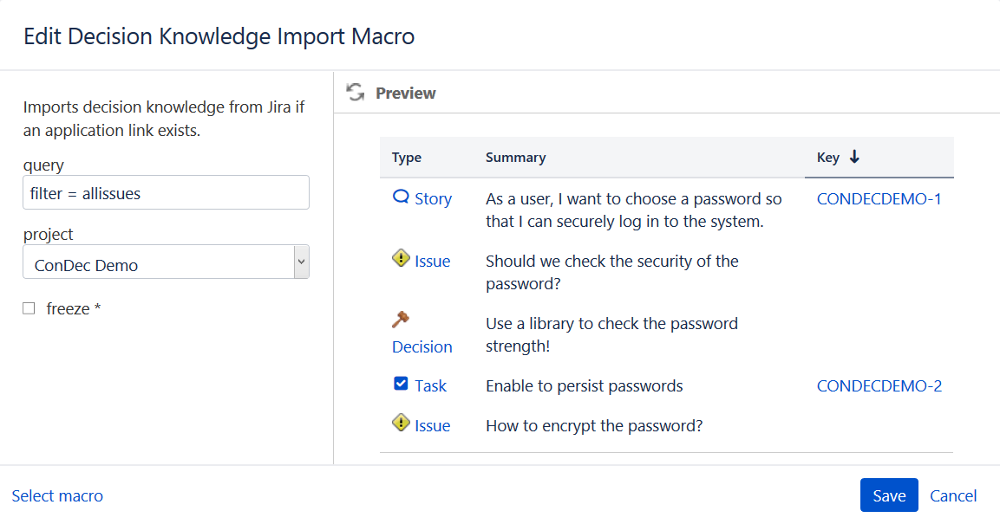
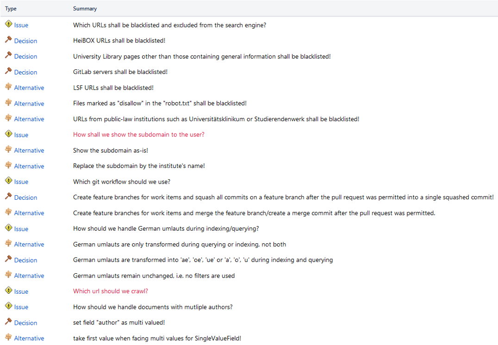

# cures-condec-confluence

[](https://github.com/cures-hub/cures-condec-confluence/actions/workflows/maven.yml)
[](https://www.codacy.com/gh/cures-hub/cures-condec-confluence/dashboard?utm_source=github.com&amp;utm_medium=referral&amp;utm_content=cures-hub/cures-condec-confluence&amp;utm_campaign=Badge_Grade)
[](https://codecov.io/gh/cures-hub/cures-condec-confluence/branch/master)
[](https://github.com/cures-hub/cures-condec-confluence/graphs/contributors)

The ConDec Confluence plugin enables to integrate decision knowledge into meeting agendas.
It enables the meeting creator to filter for decision knowledge to be shown in the meeting agenda.
For example, it enables the meeting creator to filter for decision knowledge created and relevant for the last sprint.
Thus, the developers get an overview which issues (decision problems) need to be solved or were solved, 
i.e., which decisions were made during the last sprint or need to be made during the upcoming sprint.

## Installation

### Prerequisites
The following prerequisites are necessary to compile the plug-in from source code:
- Java 11 JDK
- [Atlassian SDK](https://developer.atlassian.com/docs/getting-started/set-up-the-atlassian-plugin-sdk-and-build-a-project)

### Compilation via Terminal
The source code is compiled via terminal.
Navigate into the cures-condec-confluence folder and run the following command:
```
atlas-mvn package
```
The .jar file is created.

Run the plug-in locally via:
```
atlas-run
```

### Download of Precompiled .jar-File
The precompiled .jar-File for the latest release can be found here: https://github.com/cures-hub/cures-condec-confluence/releases/latest

## Usage

### Application Link between Confluence and Jira
To share decision knowledge between Jira and Confluence, they need to be linked via an [application link](https://confluence.atlassian.com/adminjiraserver/using-applinks-to-link-to-other-applications-938846918.html).
The authentication type needs to be **OAuth (impersonation)**.

### Decision Knowledge Import Macro
The *Decision Knowledge Import Macro* can be used to create a stand-up table in meetings. 


*Macro to import decision knowledge from Jira*

The stand-up table lists open and solved decision problems, decisions, and other decision knowledge elements for a certain time frame.
The list of decision knowledge elements support the developers in discussing recently made decisions and open decision problems during meetings.


*List of decision knowledge elements as part of a meeting agenda/protocol (used as stand-up table)*

### Design Details
The decision knowledge is imported from [ConDec Jira](https://github.com/cures-hub/cures-condec-jira) via the REST API.
To access ConDec Jira's REST API, the application link between Confluence and Jira is used in the [JiraClient class](src/main/java/de/uhd/ifi/se/decision/management/confluence/oauth).